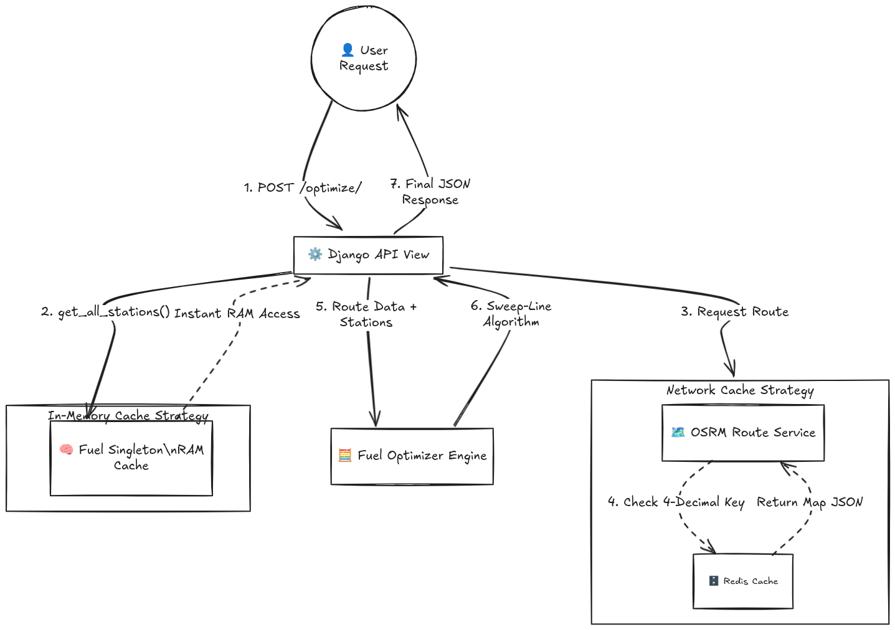

# 🗺️ Fuel Route Optimizer API

A high-performance Django REST API that calculates the optimal driving route between two points in the USA and determines the most cost-effective fuel stops along the way based on vehicle range and live fuel prices.

## 🏗️ System Architecture



## 🚀 Quick Start (Docker)

The application is fully containerized, including a local Redis instance for aggressively caching routing requests.

**1. Clone the repository and navigate to the project root:**
bash
https://github.com/Abi2841/Fuel-Route-Optimizer-Django-OSRM-Redis.git
cd Fuel-Route-Optimizer-Django-OSRM-Redis


**2. Build and start the containers:**
bash
docker compose up --build

*Note: On the very first startup, the Django AppConfig will automatically enrich the raw OPIS fuel dataset with geographic coordinates and cache it in application RAM. This initial boot takes a few moments.*

**3. The server is now running at:** `http://localhost:8000`

---

## 📡 API Endpoints

### 1. Health Check
Verify the API is running and check how many fuel stations were successfully loaded into the in-memory cache.

* **URL:** `GET /api/routes/health/`
* **Response:**
  ```json
  {
      "status": "healthy",
      "fuel_stations_loaded": 45123
  }
  ```
### 2. Optimize Route
Calculate the route, retrieve turn-by-turn geometry, and map the mathematically optimal fueling stops.
* **URL:** `POST /api/routes/optimize/`
* **Sample Payload:**
  ```json
  {
  "origin": {
    "lat": 40.7128,
    "lng": -74.0060
  },
  "destination": {
    "lat": 34.0522,
    "lng": -118.2437
  }
    }
  ```
* **Sample Response:**
  ```json
  "status": "success",
    "message": "Route optimization completed",
    "primary_route": {
        "total_distance": 2790.5,
        "total_fuel_cost": 450.25,
        "avg_fuel_price": 3.20,
        "cached": false,
        "fuel_stops": [
            {
                "station_name": "Pilot Travel Center",
                "city": "Kearny",
                "state": "NJ",
                "price_per_gallon": 3.45,
                "distance_along_route": 12.5,
                "fuel_gallons": 15.2,
                "cost": 52.44,
                "lat": 40.7410,
                "lng": -74.1130
            }
        ]
    },
    "response_time_ms": 1245.3
  ```